# CycleGAN 复现实验

基于论文 *Unpaired Image-to-Image Translation using Cycle-Consistent Adversarial Networks* (Zhu et al., ICCV 2017) 的复现实验。

本项目在 Maps、Monet2Photo 和 Cityscapes 三个数据集上**从零完成了 200 epoch 的完整训练**。包含完整的训练日志、测试结果、损失曲线可视化与数据分析报告。

## 复现配置

所有超参数严格遵循论文设定：

| 组件 | 配置 |
|------|------|
| 生成器 G / F | ResNet-9blocks, ngf=64 |
| 判别器 D_X / D_Y | 70×70 PatchGAN, ndf=64, 3层 |
| 归一化 | Instance Normalization |
| GAN 损失 | LSGAN |
| 循环一致性损失 | L1, λ=10 |
| 身份损失 | 0.5λ |
| 优化器 | Adam (lr=0.0002, β₁=0.5) |
| Batch Size | 1 |
| 图像缓冲池 | 50 |
| 训练策略 | 100 epoch 恒定 lr + 100 epoch 线性衰减至 0 |

详细的参数对照与论文一致性分析见 [复现数据分析报告](复现数据分析报告.md)。

## 实验数据集

| 数据集 | 域 A | 域 B | 训练方式 | 每轮迭代 | 测试样本 |
|--------|------|------|----------|----------|----------|
| Maps | 航拍图 | 地图 | 从零训练 200 epoch | 1096 | 50 组 |
| Monet2Photo | 莫奈画作 | 真实照片 | 从零训练 200 epoch | 6287 | 63 组 |
| Cityscapes | 真实照片 | 语义分割图 | 从零训练 200 epoch | 2975 | 50 组 |

## 训练结果

### 损失曲线

<p align="center">
  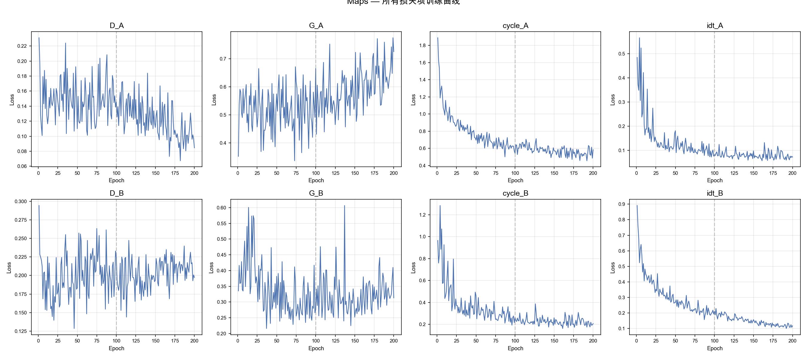
  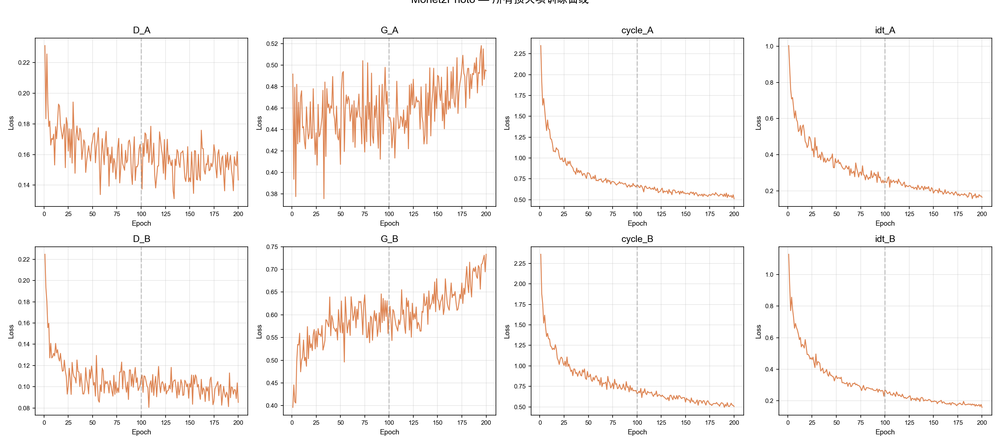
  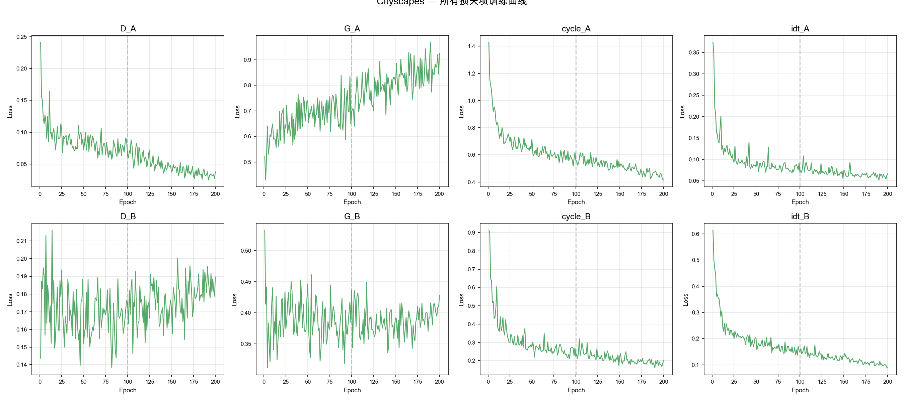
</p>
<p align="center">Maps（左）、Monet（中）、Cityscapes（右）200 epoch 全损失曲线</p>

<p align="center">
  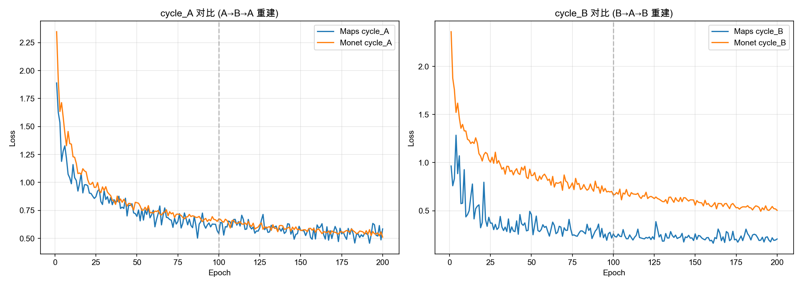
  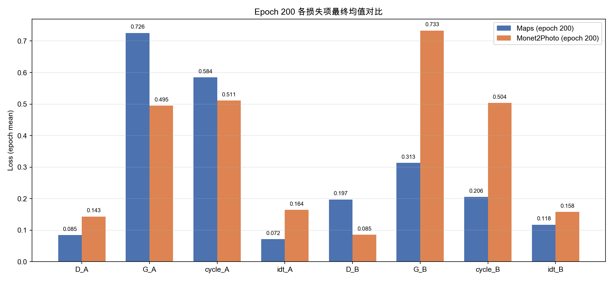
</p>
<p align="center">跨数据集 Cycle Loss 收敛对比（左）与 Epoch 200 各项损失终值对比（右）</p>

### 测试样例

**Maps：航拍图 → 地图 (A→B)**

| 输入 real_A (航拍图) | 生成 fake_B (地图) | 真实 real_B (地图) |
|:---:|:---:|:---:|
| 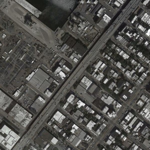 | 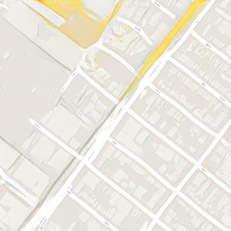 | 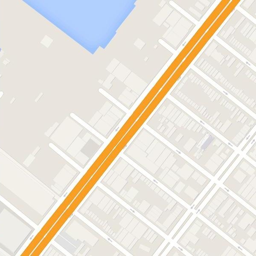 |
| 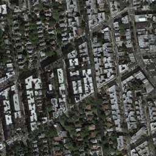 | 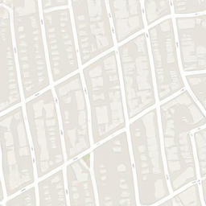 |  |

**Monet2Photo：莫奈画作 → 真实照片 (A→B)**

| 输入 real_A (莫奈画作) | 生成 fake_B (照片) | 重建 rec_A (莫奈画作) |
|:---:|:---:|:---:|
|  |  |  |
|  |  |  |

**Cityscapes：真实照片 → 语义分割 (A→B)**

| 输入 real_A (照片) | 生成 fake_B (分割图) | 真实 real_B (分割图) |
|:---:|:---:|:---:|
| 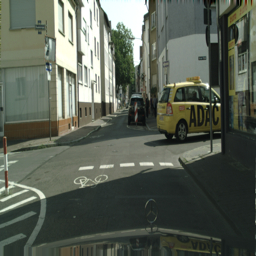 | 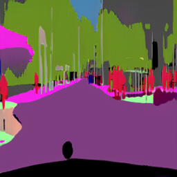 | 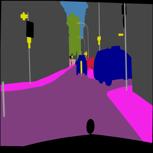 |
| 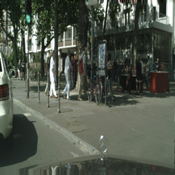 | 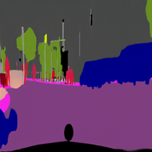 | 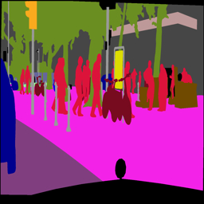 |

## Demo

项目包含交互式网页 Demo，可浏览全部测试结果、训练曲线与超参数配置。

### 截图预览

<p align="center">
  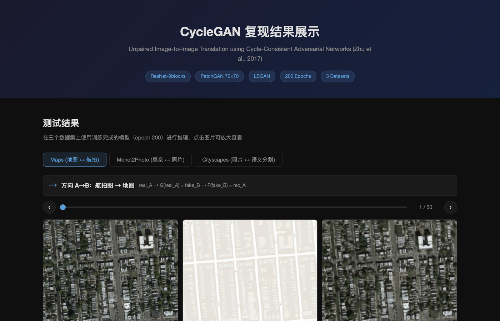
</p>
<p align="center">Demo 首页：Maps 数据集测试结果（航拍图 → 地图）</p>

<p align="center">
  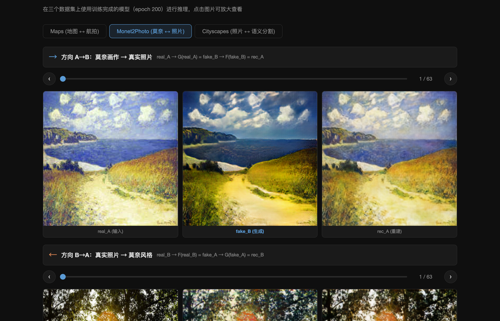
  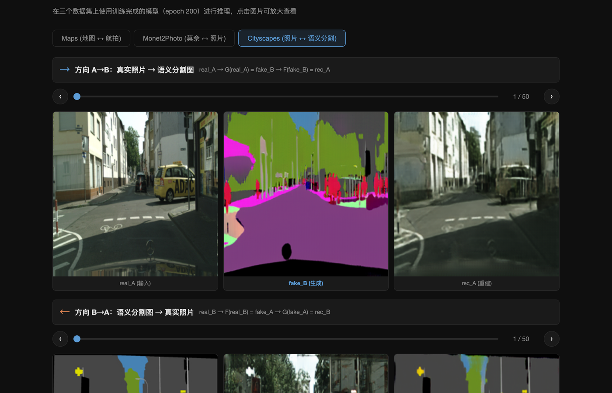
</p>
<p align="center">Monet2Photo（左）与 Cityscapes（右）测试结果展示</p>

<p align="center">
  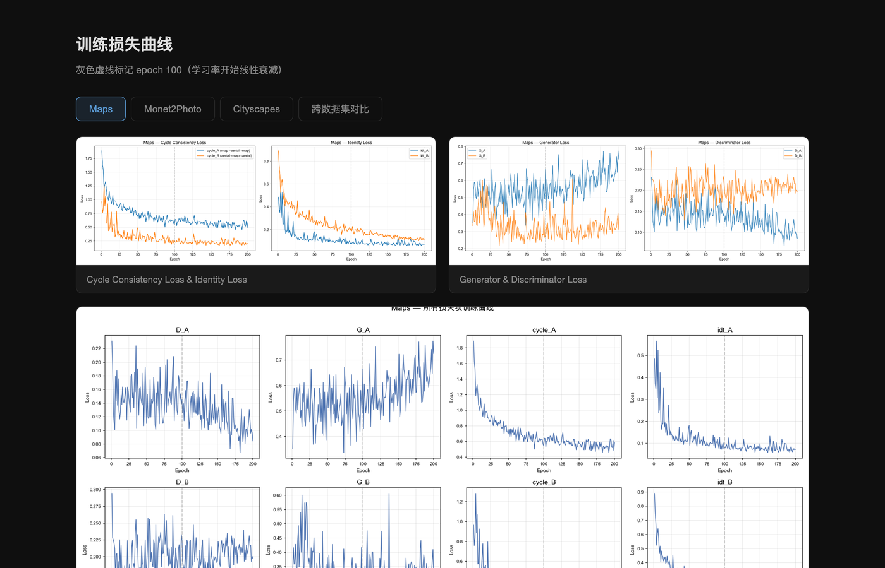
</p>
<p align="center">训练损失曲线可视化</p>

### 使用步骤

1. **克隆仓库**

   ```bash
   git clone https://github.com/legendd233/cyclegan_reproduce.git
   cd cyclegan_reproduce
   ```

2. **启动本地服务器**（Demo 通过相对路径加载图片，需要 HTTP 服务）

   ```bash
   python -m http.server 8000
   ```

3. **打开浏览器访问**

   ```
   http://localhost:8000/demo.html
   ```

### Demo 功能

- **三个数据集标签页**：Maps / Monet2Photo / Cityscapes
- **双向翻译展示**：每个数据集包含 A→B 和 B→A 两个方向的测试结果
- **样本浏览**：滑动条/左右箭头/键盘方向键切换测试样本，展示 real → fake → rec 完整流程
- **图片放大**：点击任意图片弹出 lightbox 大图查看
- **训练损失曲线**：三个数据集各自的 8 项损失曲线及跨数据集对比
- **训练配置与统计**：完整超参数表、数据集统计和 Epoch 200 损失均值对比

> 也可以直接打开 `demo.html`，但部分浏览器会因本地文件跨域限制无法加载图片，推荐使用本地服务器。

## 项目结构

```
├── README.md                    # 本文件
├── 复现数据分析报告.md            # 完整数据分析报告（配置对照、损失分析、测试评估）
├── demo.html                    # 交互式结果展示网页
├── plot_losses.py               # 训练日志解析与损失曲线绘制（含多 session 清洗）
├── verify_report.py             # 报告数据自动核验脚本
├── figures/                     # 损失曲线可视化 & Demo 截图 (16 张 PNG)
│   ├── fig1-2_maps_*.png        # Maps 损失曲线
│   ├── fig3-4_monet_*.png       # Monet 损失曲线
│   ├── fig9-10_cityscapes_*.png # Cityscapes 损失曲线
│   ├── fig5-6,7-8,11_*.png      # 跨数据集对比 & 全损失总览
│   └── demo_*.png               # Demo 网页截图
├── checkpoints/
│   ├── maps_cyclegan/           # 训练日志 (loss_log.txt)、配置 (train/test_opt.txt)
│   ├── monet_cyclegan/          # 同上
│   └── checkpoints/cityscapes_cyclegan/  # 同上
└── results/
    ├── maps_cyclegan/           # Maps 测试输出 (50 组 × 6 张)
    ├── monet_cyclegan/          # Monet 测试输出 (63 组 × 6 张)
    └── cityscapes_cyclegan/     # Cityscapes 测试输出 (50 组 × 6 张)
```

> 模型权重文件 (`.pth`, 共约 9GB) 和训练过程可视化图片 (3200 张) 未上传。如需权重请联系作者。
