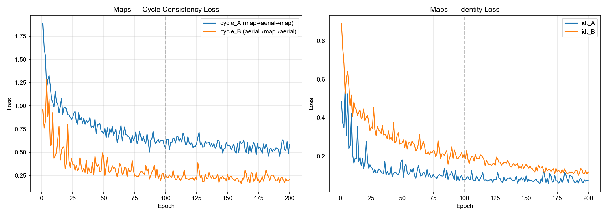
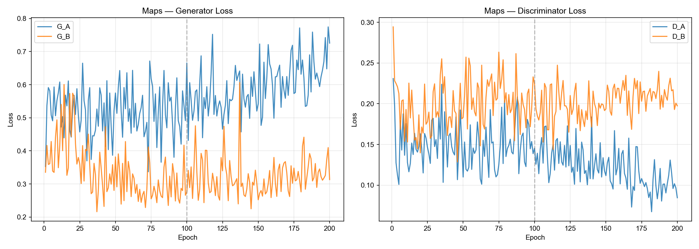
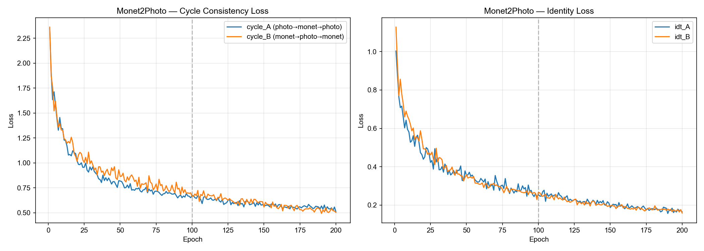
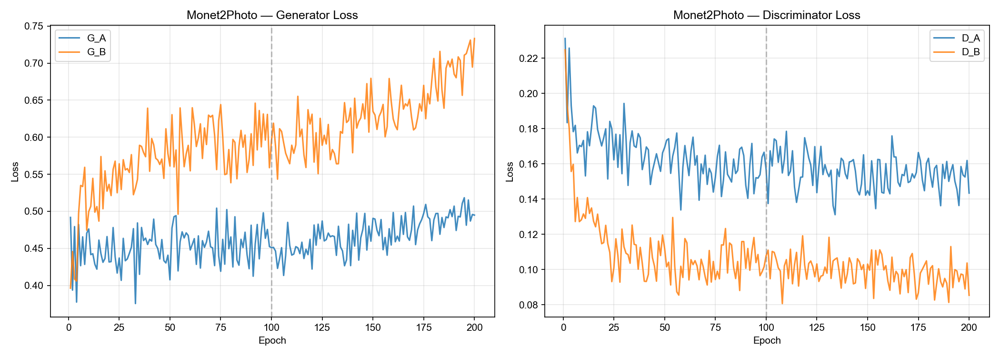
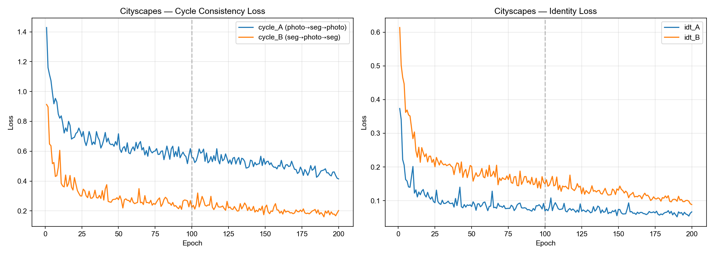
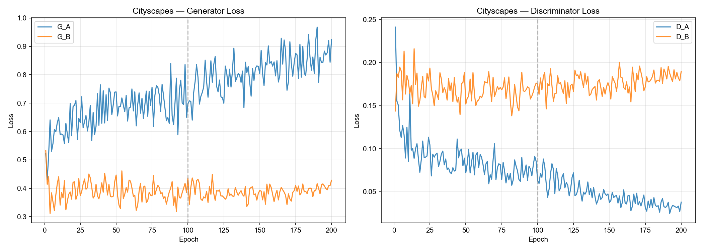
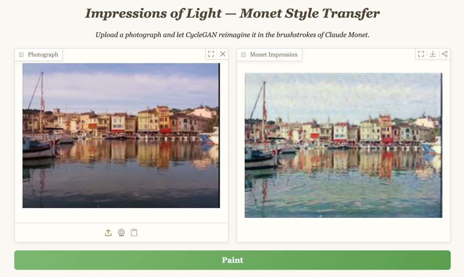

# CycleGAN Reproduction

Reproduction of *Unpaired Image-to-Image Translation using Cycle-Consistent Adversarial Networks* (Zhu et al., ICCV 2017).

This project completes **full 200-epoch training from scratch** on three datasets: Maps, Monet2Photo, and Cityscapes. Includes training logs, test results, loss curve visualizations, and analysis.

## Training Configuration

All hyperparameters strictly follow the original paper:

| Component | Configuration |
|-----------|---------------|
| Generator G / F | ResNet-9blocks, ngf=64 |
| Discriminator D_X / D_Y | 70×70 PatchGAN, ndf=64, 3 layers |
| Normalization | Instance Normalization |
| GAN Loss | LSGAN |
| Cycle Consistency Loss | L1, λ=10 |
| Identity Loss | 0.5λ |
| Optimizer | Adam (lr=0.0002, β₁=0.5) |
| Batch Size | 1 |
| Image Buffer | 50 |
| LR Schedule | 100 epochs constant + 100 epochs linear decay to 0 |

## Datasets

| Dataset | Domain A | Domain B | Training | Iters/Epoch | Test Samples |
|---------|----------|----------|----------|-------------|--------------|
| Maps | Aerial photos | Maps | 200 epochs from scratch | 1096 | 50 pairs |
| Monet2Photo | Monet paintings | Real photos | 200 epochs from scratch | 6287 | 63 pairs |
| Cityscapes | Real photos | Semantic labels | 200 epochs from scratch | 2975 | 50 pairs |

## Training Results

### Loss Curves

#### Cross-Dataset Comparison

<p align="center">
  
  
</p>
<p align="center">Cross-dataset Cycle Loss convergence (left) and Epoch 200 final loss comparison (right)</p>

Cycle loss across all three datasets decreases from 1.0–2.5 to 0.2–0.5. Discriminator losses remain stable in the 0.01–0.35 range with no mode collapse or gradient explosion.

#### Maps

<p align="center">
  
  
</p>
<p align="center">Maps Cycle & Identity Loss (left) and GAN Loss (right)</p>

<p align="center">
  
</p>
<p align="center">Maps — All Losses Overview</p>

#### Monet2Photo

<p align="center">
  
  
</p>
<p align="center">Monet Cycle & Identity Loss (left) and GAN Loss (right)</p>

<p align="center">
  
</p>
<p align="center">Monet — All Losses Overview</p>

#### Cityscapes

<p align="center">
  
  
</p>
<p align="center">Cityscapes Cycle & Identity Loss (left) and GAN Loss (right)</p>

<p align="center">
  
</p>
<p align="center">Cityscapes — All Losses Overview</p>

### Test Samples

**Maps: Aerial Photo → Map (A→B)**

| Input real_A (Aerial) | Generated fake_B (Map) | Ground Truth real_B (Map) |
|:---:|:---:|:---:|
|  |  |  |
|  |  |  |

**Monet2Photo: Monet Painting → Real Photo (A→B)**

| Input real_A (Monet) | Generated fake_B (Photo) | Reconstructed rec_A (Monet) |
|:---:|:---:|:---:|
|  |  |  |
|  |  |  |

**Cityscapes: Real Photo → Semantic Segmentation (A→B)**

| Input real_A (Photo) | Generated fake_B (Segmentation) | Ground Truth real_B (Segmentation) |
|:---:|:---:|:---:|
|  |  |  |
|  |  |  |

### Qualitative Analysis

| Dataset | A→B Quality | B→A Quality | Cycle Reconstruction |
|---------|-------------|-------------|----------------------|
| Maps | Good — roads, water, buildings correctly mapped | Good — realistic textures, clear region separation | Good — highly consistent with input |
| Monet2Photo | Good — natural brushstroke-to-photorealism conversion | Good — successfully learns Monet style features | Good — preserves composition and tone |
| Cityscapes | Fair — major semantic regions reasonable, limited detail | Fair — plausible textures but somewhat dark | Good — mostly consistent |

Cityscapes performance aligns with the paper: CycleGAN's segmentation accuracy without paired supervision is lower than supervised methods like pix2pix (Paper Table 2/3), but it excels at style/texture transfer tasks like Maps and Monet.

## Comparison with Paper

| Metric | Paper | Our Reproduction | Consistent |
|--------|-------|------------------|------------|
| Cycle loss convergence | Reconstructed images close to input (Figure 4) | cycle_A/B decreases from ~2.0 to ~0.5 | Yes |
| GAN training stability | LSGAN provides stable training | D_A/D_B — no collapse or explosion | Yes |
| LR schedule | Constant for first 100 epochs, linear decay for next 100 | Loss continues smooth decline after epoch 100 | Yes |
| Image buffer | 50 historical images reduce oscillation | Discriminator loss fluctuation remains smooth | Yes |
| Identity loss | Helps preserve color consistency | idt_A/B converges quickly to low values | Yes |

## Demo

Gradio + Docker based online demo. Upload a photo to transform it into Monet impressionist style in real time. Uses Epoch 115 G_B generator weights.

**Live Demo: http://47.245.107.172:7860/**

<p align="center">
  
</p>
<p align="center">Monet Style Transfer Demo Screenshot</p>

### Run Locally

```bash
cd demo
docker build -t cyclegan-demo .
docker run -d --name cyclegan-demo -p 7860:7860 cyclegan-demo
# Visit http://localhost:7860
```

### Features

- Upload any photo for real-time Monet impressionist style transfer
- Output preserves the original image dimensions
- Built-in example images — click Paint to try instantly